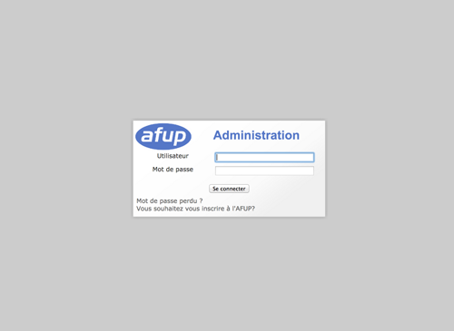

# Installation

## For Linux and OS X users

    Install a MySQL database following [official instructions](http://dev.mysql.com/doc/refman/5.7/en/installing.html)

    # Create project directory
    mkdir afup

### Install legacy application

    # Change current directory to newly created project directory
    cd afup

    # Clone legacy back-office repository
    git clone https://github.com/afup/web.git legacy-back-office

    # Configure database
    cp legacy-back-office/configs/application/config.php{.dist,}

Update the following items in legacy-back-office/configs/application/config.php

 * host ("hote")
 * database ("base") 
 * username ("utilisateur")
 * password ("mot_de_passe") 

### Install target application

Install project files

    ## Ensure you have not changed directory since previous commands execution
    cd ../afup

    # Clone target application
    git clone https://github.com/afup/back-office.git

Download composer to install dependencies

    curl -sS https://getcomposer.org/installer | php

Install dependencies

    php composer.phar install --prefer-dist

Install assets

    php app/console assets:install web
    php app/console assetic:dump 

Run build-in PHP server in development (available since PHP 5.4)

    php app/console server:run 

Apply database migrations

    php app/console doctrine:migrations:mig 

Load development fixtures

    php app/console doc:fix:load  --append --fixtures=src/Afup/Bundle/MemberBundle/Tests/DataFixtures/ORM

Generate entities from model and configured mapping (`src/Afup/Model/Mapping`)

    php app/console generate:doctrine:entities Afup/Model --path=src

### Acceptance tests

By the end of the installation, one should be able to access the legacy back-office (when using server:run command) at

[http://127.0.0.1:8000/pages/administration/index.php](pages/administration/index.php)
    

